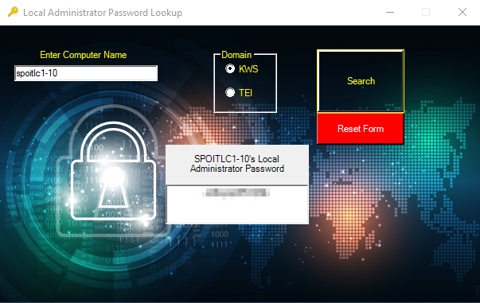

# LAPS-Multi-Domain-GUI

Tool was created because the Microsoft provided LAPS GUI client does not support querying computers in more than one domain. Currently used for only 2 domains but can easily be updated for as many Domains/domain controllers as needed to fit your needs. 
